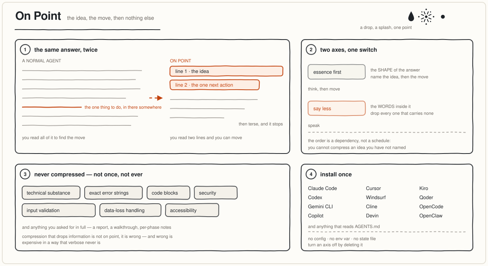

<p align="center">
  
</p>

<p align="center">
  <strong>say the big thing first, then the one next action, then say less</strong>
</p>

<p align="center">
  Two axes on one switch, for any AI agent.<br>
  A drop, a splash, then one point — the answer arrives already landed.<br>
  Substance, security and exact errors: byte-for-byte untouched.
</p>

<p align="center">
  <a href="https://github.com/HuskyDanny/OnPoint/stargazers"></a>
  <a href="#install"></a>
  <a href="https://github.com/HuskyDanny/OnPoint/commits/main"></a>
  <a href="LICENSE"></a>
</p>

<p align="center">
  <a href="#before--after">See it</a> ·
  <a href="#install">Install</a> ·
  <a href="#the-two-axes">Axes</a> ·
  <a href="#how-it-works">How</a>
</p>

---

On Point is a skill/plugin for [Claude Code](https://code.claude.com/docs), Codex,
Gemini CLI, Cursor, Windsurf, Cline, Copilot, Kiro, Qoder, OpenCode, OpenClaw, Devin,
and anything that reads `AGENTS.md`. Install once. The agent opens with the point
instead of the mechanism, puts the one thing you can do next directly under it, and
drops every word in between — while code, commands and error strings stay
byte-for-byte exact.

> Everything can be abstract. Einstein could state relativity in one sentence; a
> person who truly knows a thing explains it simply.

The name is the mark. A **drop** lands, a **splash** throws it in every direction,
and it all resolves to a single **point** — which is the only frame you wanted.

## Before / after

Token counts are real, measured with `o200k_base`.

A real exchange, translated from the Chinese — *"I think I have heatstroke, what do I
do?"* All three personas at work in one answer: name the thing in one line, lead with
the action, cut everything else.

<table>
<tr><th width="50%">Normal agent — 408 tokens</th><th width="50%">On Point — 155 tokens</th></tr>
<tr valign="top"><td>

Heatstroke — first work out how severe it is. Start by checking for danger signs:

🚨 **Call an ambulance immediately if:**

- Confused, incoherent, convulsing, or passed out and unrousable
- Skin burning hot but not sweating (no sweat is the classic sign of heat stroke)
- Body temperature over 40°C
- Vomiting continuously, unable to drink

This is heat stroke. Mortality is high. While waiting, pour cold water over them and fan them.

If it is only dizziness, weakness, nausea, heavy sweating, muscle cramps (heat exhaustion / mild) do these in order, immediately:

1. **Get out of the heat** — into air conditioning or a shaded, ventilated spot. Lie down, legs slightly raised
2. Take off excess clothing, loosen the collar and belt
3. **Cool physically** — cold towel or ice pack on the neck, armpits, and groin (where the big vessels run), sponge with lukewarm water + a fan. Do not plunge them into ice water, it causes shivering that raises temperature instead
4. **Rehydrate** — small sips of lightly salted water or an electrolyte drink. Plain water alone dilutes electrolytes and makes cramps worse
5. Do not drink: alcohol, coffee, strong tea (diuretics, dehydrating)
6. For cramps, stretch and massage gently. Do not force the limb straight

**Watch for**

- Clear improvement within 30 minutes. No improvement or getting worse, go to hospital
- No heat exposure and no exercise for the next two days
- Watch urination: dark brown urine → possible rhabdomyolysis, get help quickly

How are you feeling now? Any of the danger signs above, or are you somewhere cool already?

</td><td>

Cool them down before giving fluids — the danger is core temperature, not thirst.

**Do now:**

1. Get out of the heat, into shade or air conditioning, strip excess clothing
2. Cool physically: sponge with cold water, damp towel + fan, focus on neck, armpits, groin
3. Small sips of salted water or an electrolyte drink. Do not gulp ice water
4. Lie flat, raise the legs

**Call an ambulance immediately, do not tough these out:**

- Confused, incoherent, convulsing, unconscious
- Body temperature 40°C or above
- Skin burning hot but not sweating
- Vomiting continuously, cannot keep water down

Take their temperature first. If you can, measure it now.

</td></tr>
</table>

**−62%**, and the shape is the point rather than the saving. The left column buries the
one thing that decides everything — *cool first, fluids second* — under a triage
decision the reader has to make before they can act. The right column states it, then
hands over four numbered actions, then the danger signs, then one thing to do now.

Every danger sign survives verbatim: that list is a **security measure** by the
doctrine's never-compress rule, so it is not eligible for cutting. What *is* deferred
is the follow-up — the 30-minute recovery window, the two-day rule, the
dark-urine/rhabdomyolysis warning. That is drill-down the reader pulls when the
emergency is over, and calling it free would be dishonest: it is a deliberate deferral,
chosen because a reader in the first minute of this needs four steps they will actually
finish over ten they will abandon.

## Install

**Claude Code**

```
/plugin marketplace add HuskyDanny/OnPoint
/plugin install on-point@on-point
```

That is it. There is also an optional output style if you want the same behaviour
stated as a role rather than a rulebook — `/config` → **Output style** → `On Point`.
It replaces whichever style you have selected, so installing never picks it for you.

**Every other agent** — clone and let the installer detect what your project uses:

```bash
git clone https://github.com/HuskyDanny/OnPoint
cd your-project && /path/to/on-point/install.sh
```

It looks for `.cursor/`, `.windsurf/`, `.clinerules/`, `.kiro/`, `.qoder/`,
`.opencode/`, `.openclaw/`, `.codex/`, `.claude/`, `.github/`, `AGENTS.md`,
`CLAUDE.md`, `GEMINI.md` and installs only for what's there. `--all` for everything,
`--dry-run` to look first, `--uninstall` to undo. If the Claude Code plugin is already
installed it skips the Claude surfaces rather than shipping you the same rules twice.

**Your own instruction files are never overwritten.** `AGENTS.md`, `CLAUDE.md`,
`GEMINI.md` and `.github/copilot-instructions.md` usually already hold your rules, so
the block is spliced between markers — re-running replaces only our block, and
`--uninstall` restores the file byte-for-byte.

<details>
<summary>Or drop in one file by hand</summary>

| agent | file |
|---|---|
| Codex, Amp, Jules, anything AGENTS.md | `AGENTS.md` |
| Claude Code | `CLAUDE.md`, or `skills/on-point/SKILL.md` |
| Gemini CLI | `GEMINI.md` + `gemini-extension.json` |
| Cursor | `.cursor/rules/on-point.mdc` |
| Windsurf | `.windsurf/rules/on-point.md` |
| Cline | `.clinerules/on-point.md` |
| GitHub Copilot | `.github/copilot-instructions.md` |
| Kiro | `.kiro/steering/on-point.md` |
| Qoder | `.qoder/rules/on-point.md` |
| OpenCode | `.opencode/command/on-point.md` |
| OpenClaw | `.openclaw/skills/on-point/SKILL.md` |
| Devin | `.devin-plugin/plugin.json` |

Every one of those is **generated** from `personas/*.md` by `./build.sh`. Edit the
personas, never the generated file; `./test.sh` fails if any copy is stale.

</details>

## The two axes

<p align="center">
  
</p>

| governs | behave like | body |
|---|---|---|
| the **shape** of any answer — its first line, then its next line | abstract first, then i-have-adhd | `personas/01-essence-first.md` |
| everything you **say** | caveman | `personas/02-say-less.md` |

Order is load-bearing: you cannot compress an idea you have not named, and you cannot
name the right next action for a problem you have not stated simply. Altitude, then
the move, then the words.

Three source personas, two bodies. The first body merges two of them because they
answer the same question from opposite ends — **abstract first** names the idea,
**i-have-adhd** names the move the idea implies — and each is weak exactly where the
other is strong. Abstract first updates your mental model and then leaves you at the
top of a hill with no path down; adhd hands you step 1 of 5 without ever telling you
what you are climbing. Merged, the altitude line owns the opening and the action owns
the line directly beneath it. **Caveman** then runs over both: it works word by
word and never restructures an answer, which is why it composes rather than
competes — it may shorten a numbered step, never delete it.

The upstream inversion is deliberate and worth naming: i-have-adhd puts the action on
the *first* line. Here it moves to the second, because an action whose purpose you
cannot state is how you end up efficiently doing the wrong thing.

`personas/00-doctrine.md` holds the never-compress list — substance, exact errors,
code, trust-boundary validation, data-loss handling, security, accessibility, anything
asked for in full. Compression that drops information isn't on point, it's wrong.

## How it works

Install it, and the two axes are simply on — in every session, on every prompt, and
again after a context compaction. There is nothing to switch, no level to pick, no
state kept anywhere.

The rules themselves are three markdown files:

```
personas/00-doctrine.md      what is never compressed
personas/01-essence-first.md the shape of an answer
personas/02-say-less.md      the words inside it
```

File order is axis order. Rename to reorder, **delete a file to turn that axis off**.
That is the entire configuration surface, and `./build.sh` pushes any edit back out to
all fifteen agent surfaces.

## Test

```
./build.sh    # regenerate every agent surface from personas/
./test.sh     # 44 invariants, all RED-verified
```

Axes emit, an absent `personas/` degrades that axis instead of breaking a session, the
output style stays a role statement, every generated agent surface is byte-identical to
a fresh build, manifests and diagrams parse. Each
invariant was verified to actually fail when broken — a test that can't go red proves
nothing.

## Left out

Intensity levels, slash-command level switching, a statusline, a mode-tracker state
file, an `ON_POINT` env var, an SDK injector. All exist upstream; all are knobs
nobody turns twice. Deleting a `personas/*.md` file is already the off switch.

## Credit

`say less` from [caveman](https://github.com/JuliusBrussee/caveman) by Julius Brussee
(MIT). The action half of `essence first` from
[i-have-adhd](https://github.com/ayghri/i-have-adhd) by Ayoub Ghriss (MIT). The
abstract-first half is original. Reducing each plugin to its single injectable body is a
pattern borrowed from a private agent-runtime codebase, which did the same reduction to
inject both into a Claude Agent SDK worker. See
[`NOTICE`](NOTICE) for what changed and
[`LICENSES-THIRD-PARTY.md`](LICENSES-THIRD-PARTY.md) for the upstream license texts.
