<p align="center">
  
</p>

<p align="center">
  <strong>say the big thing first, then say less, then write less</strong>
</p>

<p align="center">
  Three axes on one switch, for any AI coding agent.<br>
  Same answers. <strong>29% cheaper</strong> on <a href="#benchmarks">long-horizon agentic runs</a><br>
  across three runs per arm — because the lever is run <em>length</em>, not message size.<br>
  Substance, security and exact errors: byte-for-byte untouched.
</p>

<p align="center">
  <a href="https://github.com/HuskyDanny/verboseless-all-in-one/stargazers"></a>
  <a href="#install"></a>
  <a href="https://github.com/HuskyDanny/verboseless-all-in-one/commits/main"></a>
  <a href="LICENSE"></a>
</p>

<p align="center">
  <a href="#before--after">See it</a> ·
  <a href="#install">Install</a> ·
  <a href="#the-three-axes">Axes</a> ·
  <a href="#how-it-works">How</a> ·
  <a href="#benchmarks">Benchmarks</a> ·
  <a href="#why-29-and-not-65">Why not 65%</a>
</p>

---

verboseless is a skill/plugin for [Claude Code](https://code.claude.com/docs), Codex,
Gemini CLI, Cursor, Windsurf, Cline, Copilot, Kiro, Qoder, OpenCode, OpenClaw, Devin,
and anything that reads `AGENTS.md`. Install once. The agent opens with the point
instead of the mechanism, drops the filler, and stops building things you didn't ask
for — while code, commands and error strings stay byte-for-byte exact.

> Everything can be abstract. Einstein could state relativity in one sentence; a
> person who truly knows a thing explains it simply.

## Before / after

Token counts are real, measured with `o200k_base`.

**detail less** — the answer that was already correct, but made you assemble the point yourself.

<table>
<tr><th width="50%">Normal agent — 92 tokens</th><th width="50%">verboseless — 21 tokens</th></tr>
<tr valign="top"><td>

The reason your job is stuck is that the predicate `last_event_at > COALESCE(last_retried_at, deadline_at)` evaluates false, so the sweep never claims it. Concretely, per stalled candidate we CAS-claim it time-gated, stamp `last_retried_at = now()`, increment attempts, publish the token to the queue write-ahead-then-publish, and the scaler spawns a worker which resumes and takes another look.

</td><td>

The job is waiting for an event that can no longer exist — a deadlock, not a delay.

</td></tr>
</table>

Every fact on the left is true. The reader still had to reconstruct "deadlock vs delay"
out of three steps of mechanism. **−77%**, and the point arrives first.

**say less** — same fix, a third of the words.

<table>
<tr><th width="50%">Normal agent — 63 tokens</th><th width="50%">verboseless — 21 tokens</th></tr>
<tr valign="top"><td>

The reason your React component is re-rendering is likely because you're creating a new object reference on each render cycle. When you pass an inline object as a prop, React's shallow comparison sees it as a different object every time, which triggers a re-render. I'd recommend using useMemo to memoize the object.

</td><td>

New object ref each render. Inline object prop = new ref = re-render. Wrap in `useMemo`.

</td></tr>
</table>

**−67%**. Nothing technical lost.

**write less** — the axis that saves money, because it deletes work rather than words.

<table>
<tr><th width="50%">Normal agent — 63 tokens</th><th width="50%">verboseless — 33 tokens</th></tr>
<tr valign="top"><td>

I've added a `CacheManager` class with a pluggable `EvictionPolicy` interface, an `LRUEvictionPolicy` implementation, a `CacheConfig` dataclass for the maxsize and ttl settings, and a `CacheFactory` so you can swap policies later without touching call sites. Wired it into the fetch path behind a feature flag.

</td><td>

`@lru_cache(maxsize=1000)` on the fetch function. Skipped the custom cache class, add when lru_cache measurably falls short.

</td></tr>
</table>

**−48%** on the reply — and five files that never got written, so no turns spent
writing, reading back, or testing them. That second effect is where the real money is.

## Install

**Claude Code** — the full plugin: hooks, a skill, an optional output style.

```
/plugin marketplace add HuskyDanny/verboseless-all-in-one
/plugin install verboseless@verboseless
```

**Every other agent** — clone and let the installer detect what your project uses:

```bash
git clone https://github.com/HuskyDanny/verboseless-all-in-one
cd your-project && /path/to/verboseless-all-in-one/install.sh
```

It looks for `.cursor/`, `.windsurf/`, `.clinerules/`, `.kiro/`, `.qoder/`,
`.opencode/`, `.openclaw/`, `.codex/`, `.claude/`, `.github/`, `AGENTS.md`,
`CLAUDE.md`, `GEMINI.md` and installs only for what's there. `--all` for everything,
`--dry-run` to look first, `--uninstall` to undo.

**Your own instruction files are never overwritten.** `AGENTS.md`, `CLAUDE.md`,
`GEMINI.md` and `.github/copilot-instructions.md` usually already hold your rules, so
the block is spliced between markers — re-running replaces only our block, and
`--uninstall` restores the file byte-for-byte.

<details>
<summary>Or drop in one file by hand</summary>

| agent | file |
|---|---|
| Codex, Amp, Jules, anything AGENTS.md | `AGENTS.md` |
| Claude Code | `CLAUDE.md`, or `skills/verboseless/SKILL.md` |
| Gemini CLI | `GEMINI.md` + `gemini-extension.json` |
| Cursor | `.cursor/rules/verboseless.mdc` |
| Windsurf | `.windsurf/rules/verboseless.md` |
| Cline | `.clinerules/verboseless.md` |
| GitHub Copilot | `.github/copilot-instructions.md` |
| Kiro | `.kiro/steering/verboseless.md` |
| Qoder | `.qoder/rules/verboseless.md` |
| OpenCode | `.opencode/command/verboseless.md` |
| OpenClaw | `.openclaw/skills/verboseless/SKILL.md` |
| Devin | `.devin-plugin/plugin.json` |

Every one of those is **generated** from `personas/*.md` by `./build.sh`. Edit the
personas, never the generated file; `./test.sh` fails if any copy is stale.

</details>

## The three axes

| governs | behave like | body |
|---|---|---|
| the **first line** of any answer | abstract first | `personas/01-detail-less.md` |
| everything you **say** | caveman | `personas/02-say-less.md` |
| everything you **write** | ponytail | `personas/03-write-less.md` |

Order is load-bearing: you cannot compress an idea you have not named, and you cannot
write the smallest code for a problem you have not stated simply. Altitude, then
words, then code.

`personas/00-doctrine.md` holds the never-compress list — substance, exact errors,
code, trust-boundary validation, data-loss handling, security, accessibility, anything
asked for in full. Compression that drops information isn't verboseless, it's wrong.

## How it works

<p align="center">
  
</p>

Hook events `SessionStart`, `UserPromptSubmit` and `SubagentStart` accept **plain
stdout** as context. So the mechanism is a `cat`:

```bash
cat "$root"/personas/*.md
```

Glob order is the axis order. Rename to reorder, delete to disable. No config, no env
var, no state file, no interpreter.

**Hook, not `CLAUDE.md`** — same words, different position. `CLAUDE.md` sits in the
cached system prefix: said once at the head, decaying as the transcript grows past it.
A hook lands at the **tail**, beside the live turn, re-fired every prompt and after
every compaction. The repetition is the forcing function.

`UserPromptSubmit` gets one line, not the bodies — a full copy per prompt would stack
into the re-sent context, which is the pool this exists to shrink. `SubagentStart`
gets the full bodies: a subagent's report *is* the parent's context, so compressing it
pays twice. Ponytail injects into subagents upstream, caveman doesn't; that reads as an
omission, not a decision.

### Two surfaces, two altitudes

```
OUTPUT STYLE  3.7 KB  end of system prompt    the ROLE  — which behavior, what surface
HOOK BODIES  12.1 KB  tail of the transcript  the RULES — and here is every one
```

Different content, so they never duplicate. Enable the style with `/config` →
**Output style** → `Verboseless`. It's exclusive (one at a time, so it replaces
yours), and `force-for-plugin` is deliberately unset so installing never hijacks your
choice. It's hand-written, never generated: the moment the same text sits in both the
system prompt and the tail you pay twice for one instruction, and `test.sh` fails if
the style grows past half the bodies.

## Benchmarks

Autonomous coding swarm (Claude Agent SDK, GLM-5.2), identical task every arm,
**n=3 per arm**, cost metered off the wire rather than estimated:

| | baseline | verboseless | Δ |
|---|---|---|---|
| cost per delivery | $4.74 ± 0.89 | **$3.37 ± 0.08** | **−29%** |
| output tokens | 132.5k | 89.5k | −32% |
| run-to-run variance | ±$0.89 | **±$0.08** | tightest of 9 arms |
| correct deliveries | 3/3 | 3/3 | — |

The variance column matters as much as the cost one: the combo was the most
*predictable* arm in the field, which is what you want from a default.

**What this does not show.** Two tasks, one model (GLM-5.2), and these persona
prompts are Claude-tuned — one upstream benchmark saw a terseness persona go
net-negative on a small model. Read it as "on this swarm and this model."

**[Read the full report →](docs/BENCHMARK.md)** — two studies, nine
configurations, 44 runs, ~$205 of model spend. Harness design, full
threats-to-validity, and the base-merge failure that invalidated an entire round.
Per-run pull-request links are omitted because they point into private
repositories — stated plainly in the report rather than hidden.

## Why 29% and not 65%

Caveman advertises "cuts 65% of output tokens (measured)", and measures it honestly —
on a one-shot reply, where the reply **is** the bill. On an agentic run it isn't:

```
baseline run cost = $5.66
  fresh input     $0.52    9.1%
  cache-read      $4.47   79.1%   ← re-sent context
  output          $0.67   11.8%   ← all a terseness persona can touch
```

Output is the **ceiling**, and it's 11.8%. Cut 65% of it → save 7.7%. Cut *all* of it
— every token the model emits, leaving an agent that does the work in total silence —
→ save 11.8%.

The measured saving is **29%**. That is **2.4× the entire output pool**, so at minimum
17 percentage points of it cannot have come from terser messages at all. Terseness is
not the mechanism; it is a side effect. The mechanism is fewer turns, and each avoided
turn deletes a full re-send of the cached context at roughly $0.03–0.04 a go.

Two
compressions stack to explain the gap: terseness only compresses **prose**, and prose
is a minority of output (reasoning alone ~⅔); output is in turn a minority of cost.
Sixty-five percent off a slice of a slice lands in single digits — which is why
caveman's own README now reports **8.5%** on long-horizon agentic runs, and that number
is the honest one for a single terseness axis.

The uncomfortable corollary: **write-less carries most of this, not say-less.** Not
building the speculative thing and not re-reading what you already read removes whole
turns, and turns are what the bill is made of.

Judge any future optimization by whether it **shortens the run**. An input-command
compressor tested alongside these landed dead-even with baseline for exactly that
reason.

## Test

```
./build.sh    # regenerate every agent surface from personas/
./test.sh     # 12 invariants, all RED-verified
```

Axes emit, the per-prompt line stays one line, an absent `personas/` degrades instead
of breaking a session, the output style stays a role statement, every generated agent
surface is byte-identical to a fresh build, manifests and diagrams parse. Each
invariant was verified to actually fail when broken — a test that can't go red proves
nothing.

## Left out

Intensity levels, slash-command level switching, a statusline, a mode-tracker state
file, a `VERBOSELESS` env var, an SDK injector. All exist upstream; all are knobs
nobody turns twice. Deleting a `personas/*.md` file is already the off switch.

## Credit

`say less` from [caveman](https://github.com/JuliusBrussee/caveman) by Julius Brussee
(MIT). `write less` from [ponytail](https://github.com/DietrichGebert/ponytail) by
Dietrich Gebert (MIT). `detail less` is original. Reducing each plugin to its single
injectable body is a pattern borrowed from a private agent-runtime codebase, which did
the same reduction to inject both into a Claude Agent SDK worker. See
[`NOTICE`](NOTICE) for what changed and
[`LICENSES-THIRD-PARTY.md`](LICENSES-THIRD-PARTY.md) for the upstream license texts.
